<picture>
  <source media="(prefers-color-scheme: dark)" srcset="assets/hero-dark.svg">
  
</picture>

  <a href="https://ugursirvermez.github.io/ugursirvermez/cv/"><picture><source media="(prefers-color-scheme: dark)" srcset="assets/links/cv-dark.svg"></picture></a>
  <a href="https://scholar.google.com/citations?user=_aIQYmwAAAAJ"><picture><source media="(prefers-color-scheme: dark)" srcset="assets/links/scholar-dark.svg"></picture></a>
  <a href="https://orcid.org/0000-0001-7266-6408"><picture><source media="(prefers-color-scheme: dark)" srcset="assets/links/orcid-dark.svg"></picture></a>
  <a href="https://www.linkedin.com/in/u%C4%9Fur-s%C4%B1rvermez-360794151/"><picture><source media="(prefers-color-scheme: dark)" srcset="assets/links/linkedin-dark.svg"></picture></a>
  <a href="https://medium.com/@ugursirvermez"><picture><source media="(prefers-color-scheme: dark)" srcset="assets/links/medium-dark.svg"></picture></a>
  <a href="mailto:ugursirvermez@hotmail.com"><picture><source media="(prefers-color-scheme: dark)" srcset="assets/links/email-dark.svg"></picture></a>

I study game engines and virtual environments as places where people learn, build the rest in Unity, and have been teaching Unity and Python since 2017. The long version is in the [interactive CV](https://ugursirvermez.github.io/ugursirvermez/cv/).

<a href="https://ugursirvermez.github.io/ugursirvermez/cv/">
  <picture>
    <source media="(prefers-color-scheme: dark)" srcset="assets/player-dark.svg">
    
  </picture>
</a>

<h3>
<picture>
  <source media="(prefers-color-scheme: dark)" srcset="assets/sections/01-dark.svg">
  
</picture>
</h3>

<a href="https://ugursirvermez.github.io/GameEngineStudio/">
  <picture>
    <source media="(prefers-color-scheme: dark)" srcset="assets/feature-dark.svg">
    
  </picture>
</a>

<a href="https://ugursirvermez.github.io/ugursirvermez/">
  <picture>
    <source media="(prefers-color-scheme: dark)" srcset="assets/play-dark.svg">
    
  </picture>
</a>

<h3>
<picture>
  <source media="(prefers-color-scheme: dark)" srcset="assets/sections/02-dark.svg">
  
</picture>
</h3>

<a href="https://ugursirvermez.github.io/ugursirvermez/cv/#education">
  <picture>
    <source media="(prefers-color-scheme: dark)" srcset="assets/timeline-dark.svg">
    
  </picture>
</a>

<h3>
<picture>
  <source media="(prefers-color-scheme: dark)" srcset="assets/sections/03-dark.svg">
  
</picture>
</h3>

<a href="https://ugursirvermez.github.io/ugursirvermez/cv/#publications">
  <picture>
    <source media="(prefers-color-scheme: dark)" srcset="assets/shelf-dark.svg">
    
  </picture>
</a>

<h3>
<picture>
  <source media="(prefers-color-scheme: dark)" srcset="assets/sections/04-dark.svg">
  
</picture>
</h3>

  <a href="https://github.com/ugursirvermez/FBC_OS-Fan-Project"><picture><source media="(prefers-color-scheme: dark)" srcset="assets/card-fbc-dark.svg"></picture></a>
  <a href="https://github.com/ugursirvermez/PyTorch_Education"><picture><source media="(prefers-color-scheme: dark)" srcset="assets/card-torch-dark.svg"></picture></a>
  <a href="https://github.com/ugursirvermez/BlazeFace_NMS_Sentis"><picture><source media="(prefers-color-scheme: dark)" srcset="assets/card-nms-dark.svg"></picture></a>
  <a href="https://github.com/ugursirvermez/Unity-ML-Test-Project"><picture><source media="(prefers-color-scheme: dark)" srcset="assets/card-mla-dark.svg"></picture></a>

<h3>
<picture>
  <source media="(prefers-color-scheme: dark)" srcset="assets/sections/05-dark.svg">
  
</picture>
</h3>

<a href="https://ugursirvermez.github.io/ugursirvermez/cv/#skills">
  <picture>
    <source media="(prefers-color-scheme: dark)" srcset="assets/skilltree-dark.svg">
    
  </picture>
</a>

<h3>
<picture>
  <source media="(prefers-color-scheme: dark)" srcset="assets/sections/06-dark.svg">
  
</picture>
</h3>

<picture>
  <source media="(prefers-color-scheme: dark)" srcset="assets/level-dark.svg">
  
</picture>

 

<picture>
  <source media="(prefers-color-scheme: dark)" srcset="assets/footer-dark.svg">
  
</picture>
