<picture>
  <source media="(prefers-color-scheme: dark)" srcset="assets/hero-dark.svg">
  
</picture>

<p align="center">
  <a href="https://scholar.google.com/citations?user=_aIQYmwAAAAJ"><picture><source media="(prefers-color-scheme: dark)" srcset="assets/links/scholar-dark.svg"></picture></a>
  <a href="https://orcid.org/0000-0001-7266-6408"><picture><source media="(prefers-color-scheme: dark)" srcset="assets/links/orcid-dark.svg"></picture></a>
  <a href="https://www.linkedin.com/in/u%C4%9Fur-s%C4%B1rvermez-360794151/"><picture><source media="(prefers-color-scheme: dark)" srcset="assets/links/linkedin-dark.svg"></picture></a>
  <a href="https://medium.com/@ugursirvermez"><picture><source media="(prefers-color-scheme: dark)" srcset="assets/links/medium-dark.svg"></picture></a>
  <a href="mailto:ugursirvermez@hotmail.com"><picture><source media="(prefers-color-scheme: dark)" srcset="assets/links/email-dark.svg"></picture></a>
</p>

I'm doing a PhD in Computer and Instructional Technologies Education at Bursa Uludağ University. The academic half of me studies game engines and virtual environments as places where people learn. The other half is usually in Unity, building whatever the first half listed under *future work*.

I've also built VR and AR applications in the private sector. I teach Unity and Python, and I write open course material for PyTorch. Most of the repositories below started as lesson material, and a few of them were written together with my students, bugs included.

<picture>
  <source media="(prefers-color-scheme: dark)" srcset="assets/player-dark.svg">
  
</picture>

<h3>
<picture>
  <source media="(prefers-color-scheme: dark)" srcset="assets/sections/01-dark.svg">
  
</picture>
</h3>

Two things I made to teach an idea by letting people poke at it. A README can't run code, so both open in the browser on GitHub Pages.

<a href="https://ugursirvermez.github.io/GameEngineStudio/">
  <picture>
    <source media="(prefers-color-scheme: dark)" srcset="assets/feature-dark.svg">
    
  </picture>
</a>

<a href="https://ugursirvermez.github.io/ugursirvermez/">
  <picture>
    <source media="(prefers-color-scheme: dark)" srcset="assets/play-dark.svg">
    
  </picture>
</a>

<h3>
<picture>
  <source media="(prefers-color-scheme: dark)" srcset="assets/sections/02-dark.svg">
  
</picture>
</h3>

<picture>
  <source media="(prefers-color-scheme: dark)" srcset="assets/timeline-dark.svg">
  
</picture>

<h3>
<picture>
  <source media="(prefers-color-scheme: dark)" srcset="assets/sections/03-dark.svg">
  
</picture>
</h3>

My work is about game engines and virtual environments in education. Lately it also covers a lot of digital citizenship and AI literacy.

**Digital citizenship and AI literacy**

- [Predicting Pre-service Teachers’ AI Literacy: The Role of Digital Literacy and Demographic Factors](https://doi.org/10.46328/ijces.277)<br><sub>*International Journal of Current Educational Studies* · 2026</sub>
- [Digital citizenship education: an in-depth study of teaching practices and research insights](https://doi.org/10.1080/10494820.2025.2542890)<br><sub>*Interactive Learning Environments* · 2026</sub>
- [Türkiye’de Dijital Vatandaşlık Eğitimi: Avrupa Konseyi Çerçevesi ile MEB Ders Kitaplarının Karşılaştırılması](https://doi.org/10.37669/milliegitim.1666472)<br><sub>*Milli Eğitim Dergisi* · 2026 · in Turkish</sub>
- [Artificial Intelligence Ethics in Digital Citizenship Education](https://doi.org/10.4018/979-8-3373-6566-4.ch008)<br><sub>Book chapter · IGI Global · 2026</sub>

**Virtual environments and instructional design**

- [Metaverse Applications in Education: Systematic Literature Review and Bibliographic Analysis of 2010–2022](https://doi.org/10.1007/978-981-99-4641-9_27)<br><sub>*Studies in Big Data* · Springer · 2023</sub>
- [Exploring the impact of computer-supported collaborative instructional design on the development of creative and critical thinking skills](https://doi.org/10.31681/jetol.1576510)<br><sub>*Journal of Educational Technology and Online Learning* · 2026</sub>

**Open material**

- [PyTorch Eğitim Kaynakları (PyTorch Education Open Educational Resource)](https://doi.org/10.5281/zenodo.19015554)<br><sub>Zenodo · 2026 · in Turkish</sub>

The full list is on [Google Scholar](https://scholar.google.com/citations?user=_aIQYmwAAAAJ) and [ORCID](https://orcid.org/0000-0001-7266-6408).

<h3>
<picture>
  <source media="(prefers-color-scheme: dark)" srcset="assets/sections/04-dark.svg">
  
</picture>
</h3>

<p align="center">
  <a href="https://github.com/ugursirvermez/FBC_OS-Fan-Project"><picture><source media="(prefers-color-scheme: dark)" srcset="assets/card-fbc-dark.svg"></picture></a>
  <a href="https://github.com/ugursirvermez/PyTorch_Education"><picture><source media="(prefers-color-scheme: dark)" srcset="assets/card-torch-dark.svg">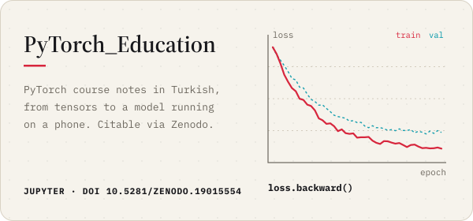</picture></a>
  <a href="https://github.com/ugursirvermez/BlazeFace_NMS_Sentis"><picture><source media="(prefers-color-scheme: dark)" srcset="assets/card-nms-dark.svg"></picture></a>
  <a href="https://github.com/ugursirvermez/Unity-ML-Test-Project"><picture><source media="(prefers-color-scheme: dark)" srcset="assets/card-mla-dark.svg"></picture></a>
</p>

Also in here: [RunToLife](https://github.com/ugursirvermez/RunToLife) and [PydewValley](https://github.com/ugursirvermez/PydewValley), both made with students · [Sarcaster-Corvus](https://github.com/ugursirvermez/Sarcaster-Corvus), a bootcamp team game set in a post-apocalyptic metaverse · [FoodVisionApp](https://github.com/ugursirvermez/FoodVisionApp), the FoodVision model from the PyTorch course running on a phone · [Space-Invader-with-Pygame](https://github.com/ugursirvermez/Space-Invader-with-Pygame) · class material in [Unity-Egitim-Materyalleri](https://github.com/ugursirvermez/Unity-Egitim-Materyalleri) and [Python_BeginnerEducation](https://github.com/ugursirvermez/Python_BeginnerEducation).

<h3>
<picture>
  <source media="(prefers-color-scheme: dark)" srcset="assets/sections/05-dark.svg">
  
</picture>
</h3>

<picture>
  <source media="(prefers-color-scheme: dark)" srcset="assets/skilltree-dark.svg">
  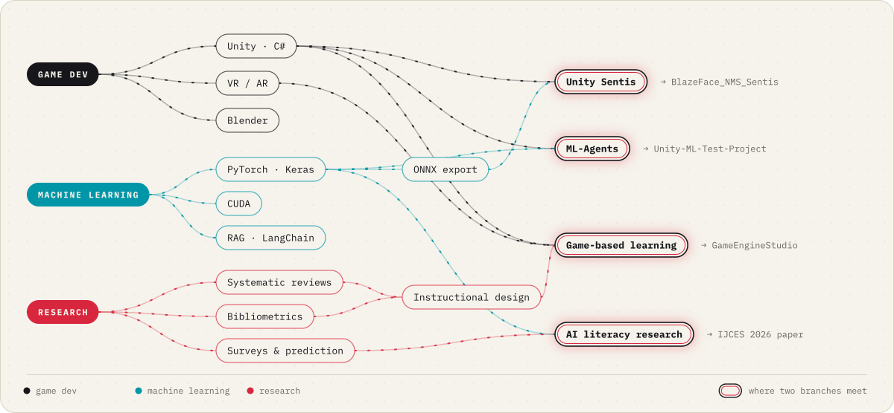
</picture>

<details>
<summary>Plain-text version</summary>

```text
engine      Unity (C#) · URP
xr          Meta XR SDK · VR and AR prototypes
ml          PyTorch · Keras · CUDA · ONNX → Unity Sentis · ML-Agents
llm         RAG · LangChain
app / web   React Native (Expo) · Next.js · TypeScript
3d          Blender
research    systematic reviews · bibliometrics · survey and predictive models
```

</details>

<h3>
<picture>
  <source media="(prefers-color-scheme: dark)" srcset="assets/sections/06-dark.svg">
  
</picture>
</h3>

My GitHub activity for the last year, played as a level. Every week is a column that grows with that week's contributions, and the five best weeks hold the coins. A GitHub Action rebuilds it every night, so the level changes as I work.

<picture>
  <source media="(prefers-color-scheme: dark)" srcset="assets/level-dark.svg">
  
</picture>

<h3>
<picture>
  <source media="(prefers-color-scheme: dark)" srcset="assets/sections/07-dark.svg">
  
</picture>
</h3>

I write on [Medium](https://medium.com/@ugursirvermez) in Turkish, mostly about teaching game development and machine learning:

- [“Texture ile Material aynı şey değil mi hocam?”](https://medium.com/@ugursirvermez/texture-ile-material-ayn%C4%B1-%C5%9Fey-de%C4%9Fil-mi-hocam-1ba7978abcfa), the question every Unity class eventually asks
- [1 Yıl Boyunca PyTorch Kullanarak Makine Öğrenmesini Öğrenmek](https://medium.com/@ugursirvermez/1-y%C4%B1l-boyunca-pytorch-kullanarak-makine-%C3%B6%C4%9Frenmesini-%C3%B6%C4%9Frenmek-0521786ece78)
- [Sosyal Bilimler Alanında Akademik Araştırma Nasıl Yapılır? Acemiler için Kılavuz](https://medium.com/@ugursirvermez/sosyal-bilimler-alan%C4%B1nda-akademik-ara%C5%9Ft%C4%B1rma-nas%C4%B1l-yap%C4%B1l%C4%B1r-acemiler-i%C3%A7in-k%C4%B1lavuz-a8eadfe17d57)

Now and then I also write about Queens of the Stone Age and Chris Cornell, which is research of a different kind.

<br>

<picture>
  <source media="(prefers-color-scheme: dark)" srcset="assets/footer-dark.svg">
  
</picture>
